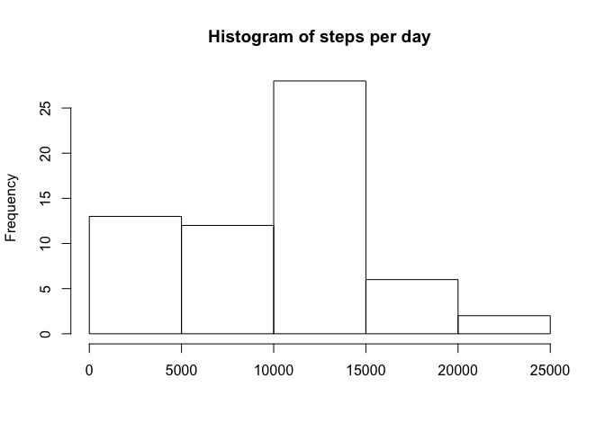
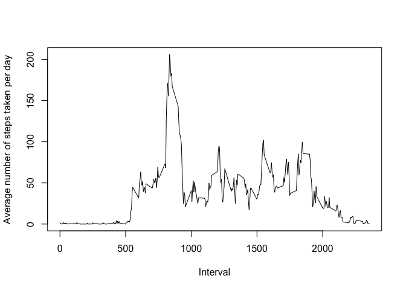
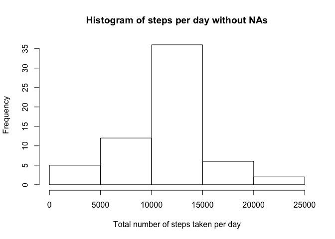

# Reproducible Research: Peer Assessment 1

### Loading and preprocessing the data


First, we download the data into the working directory:

```r
setwd("~/Documents/Dropbox/GitHub/RepData_PeerAssessment1")

if(!file.exists("./data")){
        dir.create("./data")
        }
fileUrl<-"https://d396qusza40orc.cloudfront.net/repdata%2Fdata%2Factivity.zip"
download.file(fileUrl, destfile = "./data/Dataset.zip",method="curl")
unzip(zipfile = "./data/Dataset.zip", exdir="./data")

datapath <- file.path("./data")
files <- list.files(datapath, recursive = T)
files
```

```
## [1] "activity.csv" "Dataset.zip"
```

Then, we load the data into the working directory and changing the data type:

```r
data <- read.csv(file.path(datapath, "activity.csv"), header = T)
data$date <- as.Date(data$date, format="%Y-%m-%d")
head(data)
```

```
##   steps       date interval
## 1    NA 2012-10-01        0
## 2    NA 2012-10-01        5
## 3    NA 2012-10-01       10
## 4    NA 2012-10-01       15
## 5    NA 2012-10-01       20
## 6    NA 2012-10-01       25
```

```r
str(data)
```

```
## 'data.frame':	17568 obs. of  3 variables:
##  $ steps   : int  NA NA NA NA NA NA NA NA NA NA ...
##  $ date    : Date, format: "2012-10-01" "2012-10-01" ...
##  $ interval: int  0 5 10 15 20 25 30 35 40 45 ...
```

### What is mean total number of steps taken per day?
Please note that the following installs have to be done properly in order for the libraries to be called:
1. `install.packages("ggplot2")`
2. `install.packages("dplyr")`

We will use the package `dplyr` to summarise the data:

```r
library(dplyr)
```

```
## 
## Attaching package: 'dplyr'
## 
## The following objects are masked from 'package:stats':
## 
##     filter, lag
## 
## The following objects are masked from 'package:base':
## 
##     intersect, setdiff, setequal, union
```

We then take the mean and total number of steps per day:

```r
meantotalsteps <- data %>% group_by(date) %>% summarize(totalsteps = sum(steps,na.rm=T), meansteps = mean(steps,na.rm=T))
head(meantotalsteps)
```

```
## Source: local data frame [6 x 3]
## 
##         date totalsteps meansteps
##       (date)      (int)     (dbl)
## 1 2012-10-01          0        NA
## 2 2012-10-02        126   0.43750
## 3 2012-10-03      11352  39.41667
## 4 2012-10-04      12116  42.06944
## 5 2012-10-05      13294  46.15972
## 6 2012-10-06      15420  53.54167
```

Once the data is summarised into the number of steps and total number of steps, we create the histogram

```r
hist(meantotalsteps$totalsteps, main = "Histogram of steps per day", xlab = "")
```

 

We then take the summary of the data based on total and mean of daily steps:

```r
summary(meantotalsteps$totalsteps,na.rm=T)
```

```
##    Min. 1st Qu.  Median    Mean 3rd Qu.    Max. 
##       0    6778   10400    9354   12810   21190
```

```r
summary(meantotalsteps$meansteps, na.rm=T)
```

```
##    Min. 1st Qu.  Median    Mean 3rd Qu.    Max.    NA's 
##  0.1424 30.7000 37.3800 37.3800 46.1600 73.5900       8
```

### What is the average daily activity pattern?
Here, we are finding the average of the number of steps across each 5 minute intervals to understand when is the person most active during the day.

To commence the analysis, take the mean and the total of steps grouped by interval.

```r
meantotalinterval <- data %>% group_by(interval) %>% summarise(meansteps = mean(steps, na.rm=T), totalsteps = sum(steps, na.rm=T))
head(meantotalinterval)
```

```
## Source: local data frame [6 x 3]
## 
##   interval meansteps totalsteps
##      (int)     (dbl)      (int)
## 1        0 1.7169811         91
## 2        5 0.3396226         18
## 3       10 0.1320755          7
## 4       15 0.1509434          8
## 5       20 0.0754717          4
## 6       25 2.0943396        111
```

Using the summarised data, plot the time-series data.

```r
plot(meantotalinterval$interval, meantotalinterval$meansteps,type = "l", xlab = "Interval", ylab = "Average number of steps taken per day")
```

 

If the summarised data `meantotalinterval` is sorted in a descending order of `meansteps`, the first row will show the maximum number of steps and its respective 5-minute interval.


```r
head(arrange(meantotalinterval, desc(meansteps)))
```

```
## Source: local data frame [6 x 3]
## 
##   interval meansteps totalsteps
##      (int)     (dbl)      (int)
## 1      835  206.1698      10927
## 2      840  195.9245      10384
## 3      850  183.3962       9720
## 4      845  179.5660       9517
## 5      830  177.3019       9397
## 6      820  171.1509       9071
```
Therefore, the `835` 5-minute interval on average across all the days in the dataset contains the maximum number of steps.

### Inputing missing values
There are missing data values in the dataset to possibly denote the user forgetting to wear the tracking device. Listed below is the set of steps taken to manage the missing values inside the dataset.

The set of codes below will calculate the percentage of missing values in the data, and the absolute number of values missing:

```r
mean(is.na(data$steps))
```

```
## [1] 0.1311475
```

```r
sum(is.na(data$steps))
```

```
## [1] 2304
```
According to the results, 13% to he data has "NA" values, which is equivalent to 2,304 rows.

To manage these missing values, the strategy would be to take the total of the corresponding interval as the suitable replacement. We will be using the results from `meantotalinterval` above to replace them.


```r
cleandata <- data
for (i in 1:nrow(data)){
        if (is.na(cleandata$steps[i])){
                index <- cleandata$interval[i]
                value<-subset(meantotalinterval,interval==index)
                cleandata$steps[i]<-value$meansteps
        }
}
head(cleandata)
```

```
##       steps       date interval
## 1 1.7169811 2012-10-01        0
## 2 0.3396226 2012-10-01        5
## 3 0.1320755 2012-10-01       10
## 4 0.1509434 2012-10-01       15
## 5 0.0754717 2012-10-01       20
## 6 2.0943396 2012-10-01       25
```

After observing the first 6 rows of `cleandata`, it is evident that the NAs are now replaced by the average of the number of steps for the respective intervals.

Next step would be to group the data by date, and summarise the total number of steps each day:


```r
cleansummary <- cleandata %>% group_by(date) %>% summarise(totalsteps = sum(steps, na.rm=T))
```

A histogram of the total number of steps taken each day is shown below, with the mean and median summary of the total number of steps taken per day.


```r
hist(cleansummary$totalsteps, main = "Histogram of steps per day without NAs", xlab = "Total number of steps taken per day" )
```

 

Now, we are to compare the summary between the original data and the data with NAs deleted.


```r
summary(meantotalsteps$totalsteps)
```

```
##    Min. 1st Qu.  Median    Mean 3rd Qu.    Max. 
##       0    6778   10400    9354   12810   21190
```

```r
sd(meantotalsteps$totalsteps, na.rm=T)
```

```
## [1] 5405.895
```

```r
summary(cleansummary$totalsteps)
```

```
##    Min. 1st Qu.  Median    Mean 3rd Qu.    Max. 
##      41    9819   10770   10770   12810   21190
```

```r
sd(cleansummary$totalsteps, na.rm=T)
```

```
## [1] 3974.391
```

Although the mean and the median is relatively similar, the 1st quantile of the new data is much closer to the mean. This is also reflected through the lower standard deviation, showing lower variability once the NAs have been managed through imputing missing values.

### Are there differences in activity patterns between weekdays and weekends?
Using the new dataset, we define which days are defined as a weekday and which are weekends.

First, we create a new column using the cleaner dataset:

```r
cleandata$daytype <- c("weekday")
cleandata[weekdays(as.Date(cleandata[,2])) %in% c("Saturday", "saturday", "Sunday", "sunday"),][4] <- c("weekend")
table(cleandata$daytype)
```

```
## 
## weekday weekend 
##   12960    4608
```

```r
cleandata$daytype <- factor(cleandata$daytype)
```

The next step would be to calculate the average number of steps taken averaged across all weekday days or weekend days (y-axis):

```r
cleansummary_weekday <- cleandata %>% filter(daytype == "weekday") %>%  group_by(interval) %>% summarise (totalsteps = sum(steps, na.rm = T), meansteps = mean(steps, na.rm=T))
cleansummary_weekday$daytype <- "weekday"
cleansummary_weekend <- cleandata %>% filter(daytype == "weekend") %>%  group_by(interval) %>% summarise (totalsteps = sum(steps, na.rm = T), meansteps = mean(steps, na.rm=T))
cleansummary_weekend$daytype <- "weekend"
head(cleansummary_weekday)
```

```
## Source: local data frame [6 x 4]
## 
##   interval totalsteps  meansteps daytype
##      (int)      (dbl)      (dbl)   (chr)
## 1        0 101.301887 2.25115304 weekday
## 2        5  20.037736 0.44528302 weekday
## 3       10   7.792453 0.17316562 weekday
## 4       15   8.905660 0.19790356 weekday
## 5       20   4.452830 0.09895178 weekday
## 6       25  71.566038 1.59035639 weekday
```

```r
head(cleansummary_weekend)
```

```
## Source: local data frame [6 x 4]
## 
##   interval totalsteps   meansteps daytype
##      (int)      (dbl)       (dbl)   (chr)
## 1        0  3.4339623 0.214622642 weekend
## 2        5  0.6792453 0.042452830 weekend
## 3       10  0.2641509 0.016509434 weekend
## 4       15  0.3018868 0.018867925 weekend
## 5       20  0.1509434 0.009433962 weekend
## 6       25 56.1886792 3.511792453 weekend
```

```r
cleansummary_daytype <- rbind(cleansummary_weekday,cleansummary_weekend)
```

And then, we plot the summary here.

```r
library(lattice)
xyplot(meansteps ~ interval | daytype, data = cleansummary_daytype, layout = c(1,2), type = "l", ylab = "Number of steps")
```

 


